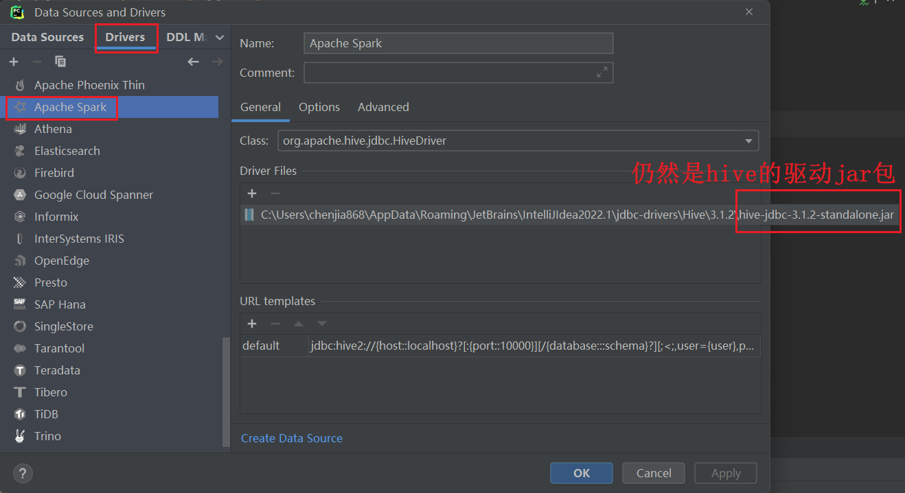
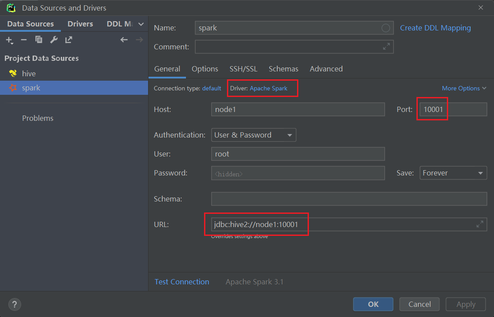
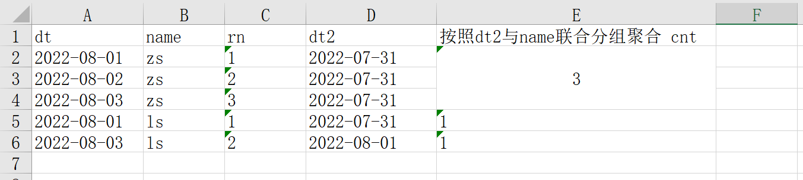
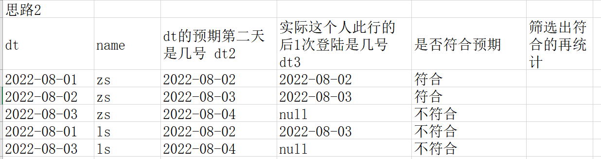
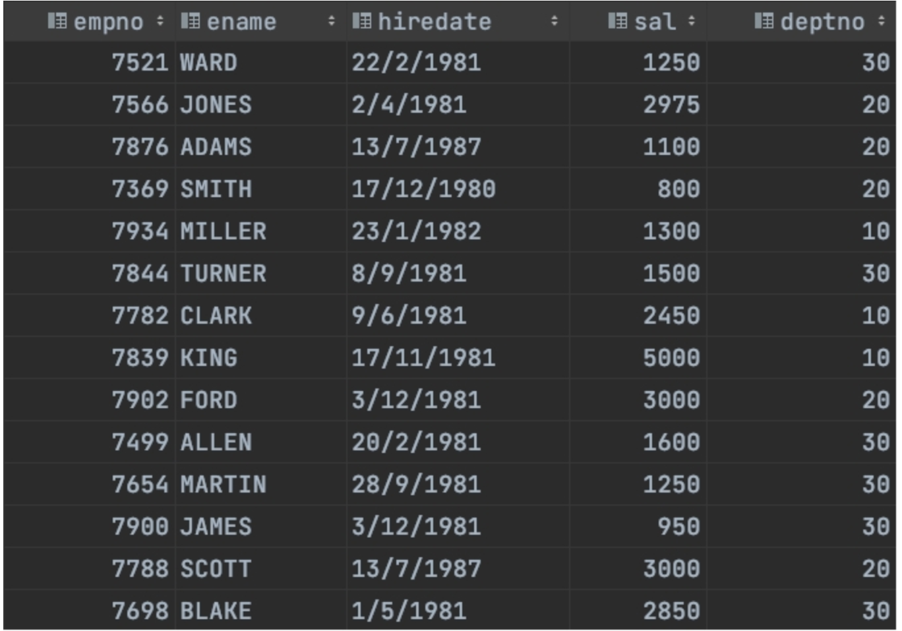
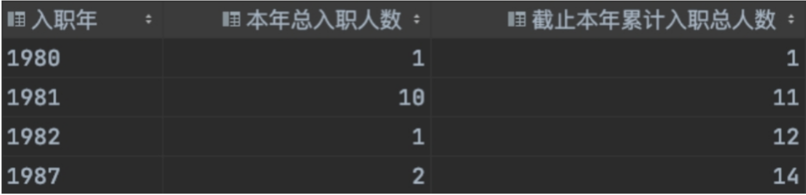

# SQL强化

## SQL执行顺序

```sql
--举例：
select 
       a.sex,
       b.city,
       count(1) as cnt,
       sum(salary) as sum1
from table1 a
join table2 b on a.id=b.id
where a.name=b.name
group by a.sex,b.city
having cnt>=2
order by a.sex,b.city
limit 10

--或者是
select distinct
       a.sex,
       b.city,
       a.age
from table1 a
join table2 b on a.id=b.id
where a.name=b.name
order by a.sex,b.city
limit 10


```

上面的SQL语句的执行顺序是: from (去加载table1 和 table2这2个表 )  -> join -> on -> where  -> group by->select 后面的聚合函数count,sum  -> having -> distinct -> order by -> limit


```sql
--on 和where的先后顺序讨论
--下面用left join 各得到结果，结果不一样。
--下面可知，先执行on，再执行where
select * 
from table1 a
left join table2 b 
on a.id=b.id
where a.name=b.name;
--下面的条数可能会比上面多。
select * 
from table1 a
left join table2 b 
on a.id=b.id
and a.name=b.name;

--下面用inner join 各得到结果，结果是一样的
select * 
from table1 a
join table2 b 
on a.id=b.id
where a.name=b.name;

select * 
from table1 a
join table2 b 
on a.id=b.id
and a.name=b.name;
```


> hivesql与sparkSQL的区别：
>
> * 子查询hive必须起别名，SparkSQL可以不用起别名
>
> * group by xx，yy，hive不用能用别名，spark可以用别名
>
> * hive不支持临时视图和缓存表，SparkSQL都支持
>
>   * ```sql
>     --用SparkSQL的临时视图
>      use interview_db;
>      create or replace temporary view t_view1 as
>      select *,
>      if(month=1,amount,0) as a1,
>      if(month=2,amount,0) as a2,
>      if(month=3,amount,0) as a3,
>      if(month=4,amount,0) as a4
>      from table2;
>     ```
>   ```
>   
>   ```
> ```
> 
> ```
>
> ```
> 
> 
> select year,
> sum(a1) as m1,
> sum(a2) as m2,
> sum(a3) as m3,
> sum(a4) as m4
> from t_view1
> group by year;
> ```
>
> ```
> 
>   * ```sql
> 
> ```
>
> ```
> 
> 
> --使用SparkSQL的缓存表
> cache table cached1 as
> select *,
> if(month=1,amount,0) as a1,
> if(month=2,amount,0) as a2,
> if(month=3,amount,0) as a3,
> if(month=4,amount,0) as a4
> from table2;
> 
> select * from cached1;
> select year,
> sum(a1) as m1,
> sum(a2) as m2,
> sum(a3) as m3,
> sum(a4) as m4
> from cached1
> group by year;
> 
> ```
>
> * 爆炸函数，hive不支持explode与普通字段联合使用，需要用侧视图分开，SparkSQL支持联合使用
>   * ```sql
>     sql
>      use interview_db;
>      select qq,game1 from tableB lateral view explode(split(game,'_')) view1 as game1 ;
>      --spark还支持这样，但是hive不支持：
>      select qq,explode(split(game,'_')) game1 from tableB ;
>     ```
>   ```
>   
>   ```
> ```
> 
> ```
>
> ```
> 
> 
> 
> * sparkSQL支持300多种函数，hiveSQL支持200多种函数。sparkSQL函数比hiveSQL要多。
> 
>   * 比如SparkSQL有sequence函数，hive就没有
> ```
>
> ```
> 
> ```


## hive10题

* 先配置环境

* 在pycharm或datagrip或idea中配置hive数据源。也可以配置一个sparkSQL数据源，来加快速度。

* 如果配置hive数据源：
  * 需要提前启动hdfs和yarn，hive的metastore，hive的hiveserver2

  * ```shell
    #启动hdfs和yarn
    start-all.sh  
    
    # hive的metastore
    nohup /export/server/hive/bin/hive --service metastore  2>&1 > /tmp/hive-metastore.log &
    
    #hive的hiveserver2
    #hiveserver2开启后，等过2分钟后才能生效。
    nohup /export/server/hive/bin/hive --service hiveserver2 2>&1 > /tmp/hive-hiveserver2.log &
    ```

    

  * 如果遇到下面的问题

  * 

  * 解决办法

    * ```
      hive/conf/hive-env.sh中加入
      export HADOOP_CLIENT_OPTS=" -Xmx512m"
      export HADOOP_HEAPSIZE=1024
      改完重启hiveserver2
      ```

* 如果配置SparkSQL数据源

  * 需要提前启动hdfs，hive的metastore，Spark的Thriftserver服务。

  * ```shell
    #启动hdfs和yarn
    start-all.sh  
    
    # hive的metastore
    nohup /export/server/hive/bin/hive --service metastore  2>&1 > /tmp/hive-metastore.log &
    
    #Spark的Thriftserver服务
    /export/server/spark/sbin/start-thriftserver.sh \
      --hiveconf hive.server2.thrift.port=10001 \
      --hiveconf hive.server2.thrift.bind.host=node1 \
      --master local[*]
    ```

  *  下面是spark3集成hive3需要的jar包，如果是spark2集成hive2，则jar包不一样。

  * 


```sql
show databases ;
create database if not exists test_sql;
use test_sql;
-- 一些语句会走 MapReduce，所以慢。 可以开启本地化执行的优化。
set hive.exec.mode.local.auto=true;-- (默认为false)
--第1题：访问量统计
CREATE TABLE test_sql.test1 (
		userId string,
		visitDate string,
		visitCount INT )
	ROW format delimited FIELDS TERMINATED BY "\t";

INSERT overwrite TABLE test_sql.test1
VALUES
    ( 'u01', '2017/1/21', 5 ),
    ( 'u02', '2017/1/23', 6 ),
    ( 'u03', '2017/1/22', 8 ),
    ( 'u04', '2017/1/20', 3 ),
    ( 'u01', '2017/1/23', 6 ),
    ( 'u01', '2017/2/21', 8 ),
    ( 'u02', '2017/1/23', 6 ),
    ( 'u01', '2017/2/22', 4 );

select *,
       sum(sum1) over(partition by userid order by month1 /*rows between unbounded preceding and current row*/ ) as `累积`
 from
(select userid,
       date_format(replace(visitdate,'/','-'),'yyyy-MM') as month1,
       sum(visitcount) sum1
from test_sql.test1
group by userid,
         date_format(replace(visitdate,'/','-'),'yyyy-MM')) as t;

-- 第2题：电商场景TopK统计
CREATE TABLE test_sql.test2 (
						 user_id string,
						 shop string )
			ROW format delimited FIELDS TERMINATED BY '\t';
INSERT INTO TABLE test_sql.test2 VALUES
( 'u1', 'a' ),
( 'u2', 'b' ),
( 'u1', 'b' ),
( 'u1', 'a' ),
( 'u3', 'c' ),
( 'u4', 'b' ),
( 'u1', 'a' ),
( 'u2', 'c' ),
( 'u5', 'b' ),
( 'u4', 'b' ),
( 'u6', 'c' ),
( 'u2', 'c' ),
( 'u1', 'b' ),
( 'u2', 'a' ),
( 'u2', 'a' ),
( 'u3', 'a' ),
( 'u5', 'a' ),
( 'u5', 'a' ),
( 'u5', 'a' );
--（1）每个店铺的UV（访客数）
-- UV和PV
-- PV是访问当前网站所有的次数
-- UV是访问当前网站的客户数(需要去重)
--(2)每个店铺访问次数top3的访客信息。输出店铺名称、访客id、访问次数
select shop,
       count(distinct user_id) as uv
from test_sql.test2 group by shop ;
--上面的拆解来看，等价于
--distinct后可以接多个字段，表示联合去重
select shop,
       count(user_id) as uv
from
(select distinct shop,
        user_id
from test_sql.test2  ) as t
group by shop ;
--也等价于
select shop,
       count(user_id) as uv
from
(select shop,
        user_id
from test_sql.test2 group by shop, user_id) as t
group by shop ;

select * from
(select *,
       row_number() over (partition by shop order by cnt desc) as rn
from
(select shop,user_id,count(1) as cnt from test_sql.test2 group by  shop,user_id ) as t) t2
where t2.rn<=3;

-- 第3题：订单量统计
CREATE TABLE test_sql.test3 (
			dt string,
			order_id string,
			user_id string,
			amount DECIMAL ( 10, 2 ) )
ROW format delimited FIELDS TERMINATED BY '\t';

INSERT overwrite TABLE test_sql.test3 VALUES
 ('2017-01-01','10029028','1000003251',33.57),
 ('2017-01-01','10029029','1000003251',33.57),
 ('2017-01-01','100290288','1000003252',33.57),
 ('2017-02-02','10029088','1000003251',33.57),
 ('2017-02-02','100290281','1000003251',33.57),
 ('2017-02-02','100290282','1000003253',33.57),
 ('2017-11-02','10290282','100003253',234),
 ('2018-11-02','10290284','100003243',234);

-- 	(1)给出 2017年每个月的订单数、用户数、总成交金额。
-- 	(2)给出2017年11月的新客数(指在11月才有第一笔订单)
select date_format(dt,'yyyy-MM') as month1,
       count(distinct order_id) as cnt1,
       count(distinct user_id) as cnt2,
       sum(amount) as amt
  from test_sql.test3
  where year(dt)=2017
group by date_format(dt,'yyyy-MM');

select count(user_id) cnt from
(select user_id,
       min(date_format(dt,'yyyy-MM')) min_month
from test3 group by user_id) as t where min_month='2017-11';

--统计每个月的新客户数
select min_month,
       count(user_id) cnt
from (select user_id,
             min(date_format(dt, 'yyyy-MM')) min_month
      from test3
      group by user_id) as t
group by min_month;


-- 第4题：大数据排序统计
CREATE TABLE test_sql.test4user
	(user_id string,name string,age int);

CREATE TABLE test_sql.test4log
	(user_id string,url string);

INSERT INTO TABLE test_sql.test4user VALUES('001','u1',10),
('002','u2',15),
('003','u3',15),
('004','u4',20),
('005','u5',25),
('006','u6',35),
('007','u7',40),
('008','u8',45),
('009','u9',50),
('0010','u10',65);
INSERT INTO TABLE test_sql.test4log VALUES('001','url1'),
('002','url1'),
('003','url2'),
('004','url3'),
('005','url3'),
('006','url1'),
('007','url5'),
('008','url7'),
('009','url5'),
('0010','url1');


select * from test_sql.test4user ;
select * from test_sql.test4log ;

--有一个5000万的用户文件(user_id，name，age)，
-- 一个2亿记录的用户看电影的记录文件(user_id，url)，根据年龄段观看电影的次数进行排序？
--取整函数有 round，floor，ceil
select *,
       round(x,0) as r,--四舍五入
       floor(x) as f,--向下取整
       ceil(x) as c--向上取整
  from
(select 15/10 as x union all
select 18/10 as x union all
select 24/10 as x union all
select 27/10 as x ) as t;

select type,
       sum(cnt) as sum1
from
(select *,
       concat(floor(age/10)*10,'-',floor(age/10)*10+10) as type
from test_sql.test4user as a
-- join前最好提前减小数据量
join (select user_id,count(url) as cnt from test_sql.test4log group by user_id) as b
on a.user_id=b.user_id) as t
group by type
order by sum(cnt) desc;

-- 第5题：活跃用户统计
CREATE TABLE test5(
dt string,
user_id string,
age int)
ROW format delimited fields terminated BY ',';
INSERT overwrite TABLE test_sql.test5 VALUES ('2019-02-11','test_1',23),
('2019-02-11','test_2',19),
('2019-02-11','test_3',39),
('2019-02-11','test_1',23),
('2019-02-11','test_3',39),
('2019-02-11','test_1',23),
('2019-02-12','test_2',19),
('2019-02-13','test_1',23),
('2019-02-15','test_2',19),
('2019-02-16','test_2',19);
select * from test_sql.test5 order by dt,user_id;
--有日志如下，请写出代码求得所有用户和活跃用户的总数及平均年龄。（活跃用户指连续两天都有访问记录的用户）
-- type     总数   平均年龄
-- '所有用户'  3    27
-- '活跃用户'  1    19
with t1 as (select distinct dt, user_id,age from test_sql.test5),
     t2 as (select *,row_number() over (partition by user_id order by dt) as rn from t1 ),
     t3 as (select *,date_sub(dt,rn) as dt2 from t2),
     t4 as (select dt2,user_id,age,count(1) cnt from t3 group by dt2,user_id,age),
     t5 as (select * from t4 where cnt>=2),
     t6 as (select distinct user_id,age from t5)
select '所有用户' as type, count(user_id) cnt,avg(age) as avg_age
from (select distinct user_id,age from test_sql.test5) t union all
select '活跃用户' as type, count(user_id) cnt,avg(age) as avg_age from t6;

-- 用思路2来分析连续2天登录
with t1 as (select distinct dt, user_id from test_sql.test5),
     t2 as (select *,
                   date_add(dt,1) as dt2,
                   lead(dt,1)over(partition by user_id order by dt) as dt3
              from t1)
select count(distinct user_id) from t2 where dt2=dt3;

-- 第6题：电商购买金额统计实战
CREATE TABLE test_sql.test6 (
		userid string,
		money decimal(10,2),
		paymenttime string,
		orderid string);

INSERT INTO TABLE test_sql.test6 VALUES('001',100,'2017-10-01','123'),
('001',200,'2017-10-02','124'),
('002',500,'2017-10-01','125'),
('001',100,'2017-11-01','126');

select * from test_sql.test6 order by userid,paymenttime;
--请用sql写出所有用户中在今年10月份第一次购买商品的金额，
select userid,paymenttime,money
from
(select *,
       row_number() over (partition by userid order by paymenttime) as rn
       from test_sql.test6 where date_format(paymenttime,'yyyy-MM')='2017-10' ) as t
where t.rn=1
;

-- 第7题：教育领域SQL实战
CREATE TABLE test_sql.book(book_id string,
		`SORT` string,
		book_name string,
		 writer string,
		 OUTPUT string,
		 price decimal(10,2));
INSERT INTO TABLE test_sql.book VALUES
('001','TP391','信息处理','author1','机械工业出版社','20'),
('002','TP392','数据库','author12','科学出版社','15'),
('003','TP393','计算机网络','author3','机械工业出版社','29'),
('004','TP399','微机原理','author4','科学出版社','39'),
('005','C931','管理信息系统','author5','机械工业出版社','40'),
('006','C932','运筹学','author6','科学出版社','55');

CREATE TABLE test_sql.reader (reader_id string,
				company string,
				name string,
				sex string,
				grade string,
				addr string);
INSERT INTO TABLE test_sql.reader VALUES
('0001','阿里巴巴','jack','男','vp','addr1'),
('0002','百度','robin','男','vp','addr2'),
('0003','腾讯','tony','男','vp','addr3'),
('0004','京东','jasper','男','cfo','addr4'),
('0005','网易','zhangsan','女','ceo','addr5'),
('0006','搜狐','lisi','女','ceo','addr6');


CREATE TABLE test_sql.borrow_log(reader_id string,
				book_id string,
				borrow_date string);

INSERT INTO TABLE test_sql.borrow_log VALUES ('0001','002','2019-10-14'),
('0002','001','2019-10-13'),
('0003','005','2019-09-14'),
('0004','006','2019-08-15'),
('0005','003','2019-10-10'),
('0006','004','2019-17-13');

select * from test_sql.book;
select * from test_sql.reader;
select * from test_sql.borrow_log;

--（8）考虑到数据安全的需要，需定时将“借阅记录”中数据进行备份，请使用一条SQL语句，
-- 在备份用户bak下创建与“借阅记录”表结构完全一致的数据表BORROW_LOG_BAK.
-- 井且将“借阅记录”中现有数据全部复制到BORROW_L0G_ BAK中。
create table test_sql.BORROW_LOG_BAK as select * from test_sql.borrow_log;
select * from test_sql.BORROW_LOG_BAK;

--（9）现在需要将原Oracle数据库中数据迁移至Hive仓库，
-- 请写出“图书”在Hive中的建表语句（Hive实现，提示：列分隔符|；
-- 数据表数据需要外部导入：分区分别以month＿part、day＿part 命名）
CREATE TABLE test_sql.book2
(
    book_id   string,
    `SORT`    string,
    book_name string,
    writer    string,
    OUTPUT    string,
    price     decimal(10, 2)
)partitioned by (month_part string,day_part string )
    row format delimited fields terminated by '|';

--（10）Hive中有表A，现在需要将表A的月分区　201505　中　
-- user＿id为20000的user＿dinner字段更新为bonc8920，其他用户user＿dinner字段数据不变，
-- 请列出更新的方法步骤。（Hive实现，提示：Hive中无update语法，请通过其他办法进行数据更新）
--A
-- user_id   user_dinner  part
-- 20000        aaaaa     201505
-- 30000        bbbbb     201505

create table A (user_id int,user_dinner string) partitioned by (part string);
insert overwrite table A partition (part = '201505')
values (20000, 'aaaaa'),
       (30000, 'bbbbb'),
       (40000, 'ccccc');
select * from A;
--update A set user_dinner='bonc8920' where user_id=20000;

insert overwrite table A partition  (part = '201505')
select user_id, 'bonc8920' as user_dinner from A where user_id=20000 and part = '201505' union all
select user_id, user_dinner from A where user_id!=20000 and part = '201505'  ;


-- 第8题：服务日志SQL统计
CREATE TABLE test_sql.test8(`date` string,
				interface string,
				ip string);

INSERT INTO TABLE test_sql.test8 VALUES
('2016-11-09 11:22:05','/api/user/login','110.23.5.23'),
('2016-11-09 11:23:10','/api/user/detail','57.3.2.16'),
('2016-11-09 23:59:40','/api/user/login','200.6.5.166'),
('2016-11-09 11:14:23','/api/user/login','136.79.47.70'),
('2016-11-09 11:15:23','/api/user/detail','94.144.143.141'),
('2016-11-09 11:16:23','/api/user/login','197.161.8.206'),
('2016-11-09 12:14:23','/api/user/detail','240.227.107.145'),
('2016-11-09 13:14:23','/api/user/login','79.130.122.205'),
('2016-11-09 14:14:23','/api/user/detail','65.228.251.189'),
('2016-11-09 14:15:23','/api/user/detail','245.23.122.44'),
('2016-11-09 14:17:23','/api/user/detail','22.74.142.137'),
('2016-11-09 14:19:23','/api/user/detail','54.93.212.87'),
('2016-11-09 14:20:23','/api/user/detail','218.15.167.248'),
('2016-11-09 14:24:23','/api/user/detail','20.117.19.75'),
('2016-11-09 15:14:23','/api/user/login','183.162.66.97'),
('2016-11-09 16:14:23','/api/user/login','108.181.245.147'),
('2016-11-09 14:17:23','/api/user/login','22.74.142.137'),
('2016-11-09 14:19:23','/api/user/login','22.74.142.137');

select * from test_sql.test8;
--求11月9号下午14点（14-15点），访问/api/user/login接口的top10的ip地址
select ip, count(1) cnt
from test_sql.test8
where date_format(`date`, 'yyyy-MM-dd HH') = '2016-11-09 14'
  and interface = '/api/user/login'
group by ip
order by cnt desc
limit 10
;

-- 第9题：充值日志SQL实战
CREATE TABLE test_sql.test9(
			dist_id string COMMENT '区组id',
			account string COMMENT '账号',
		   `money` decimal(10,2) COMMENT '充值金额',
			create_time string COMMENT '订单时间');

INSERT INTO TABLE test_sql.test9 VALUES ('1','11',100006,'2019-01-02 13:00:01'),
 ('1','22',110000,'2019-01-02 13:00:02'),
 ('1','33',102000,'2019-01-02 13:00:03'),
 ('1','44',100300,'2019-01-02 13:00:04'),
 ('1','55',100040,'2019-01-02 13:00:05'),
 ('1','66',100005,'2019-01-02 13:00:06'),
 ('1','77',180000,'2019-01-03 13:00:07'),
 ('1','88',106000,'2019-01-02 13:00:08'),
 ('1','99',100400,'2019-01-02 13:00:09'),
 ('1','12',100030,'2019-01-02 13:00:10'),
 ('1','13',100003,'2019-01-02 13:00:20'),
 ('1','14',100020,'2019-01-02 13:00:30'),
 ('1','15',100500,'2019-01-02 13:00:40'),
 ('1','16',106000,'2019-01-02 13:00:50'),
 ('1','17',100800,'2019-01-02 13:00:59'),
 ('2','18',100800,'2019-01-02 13:00:11'),
 ('2','19',100030,'2019-01-02 13:00:12'),
 ('2','10',100000,'2019-01-02 13:00:13'),
 ('2','45',100010,'2019-01-02 13:00:14'),
 ('2','78',100070,'2019-01-02 13:00:15');

select * from test_sql.test9 order by dist_id , money desc;
--请写出SQL语句，查询充值日志表2019年01月02号每个区组下充值额最大的账号，要求结果：
--区组id，账号，金额，充值时间
select * from
(select *,
       row_number() over (partition by dist_id order by money desc) rn
from  test_sql.test9 where to_date(create_time)='2019-01-02') t
where t.rn=1;

-- 第10题：电商分组TopK实战
CREATE TABLE test_sql.test10(
	`dist_id` string COMMENT '区组id',
	`account` string COMMENT '账号',
	`gold` int COMMENT '金币');

INSERT INTO TABLE test_sql.test10 VALUES ('1','77',18),
 ('1','88',106),
 ('1','99',10),
 ('1','12',13),
 ('1','13',14),
 ('1','14',25),
 ('1','15',36),
 ('1','16',12),
 ('1','17',158),
 ('2','18',12),
 ('2','19',44),
 ('2','10',66),
 ('2','45',80),
 ('2','78',98);

select * from test_sql.test10;

select * from
(select *,
       row_number() over (partition by dist_id order by gold desc) rn
from  test_sql.test10  ) t
where t.rn<=10;

```


## 行转列(转置)

* 行转列的常规做法是，group by+sum(if())【或count(if())】

### 华泰证券1

已知

| year | month | amount |
| ---- | ----- | ------ |
| 1991 | 1     | 1.1    |
| 1991 | 2     | 1.2    |
| 1991 | 3     | 1.3    |
| 1991 | 4     | 1.4    |
| 1992 | 1     | 2.1    |
| 1992 | 2     | 2.2    |
| 1992 | 3     | 2.3    |
| 1992 | 4     | 2.4    |

查成这样一个结果

| year | m1   | m2   | m3   | m4   |
| ---- | ---- | ---- | ---- | ---- |
| 1991 | 1.1  | 1.2  | 1.3  | 1.4  |
| 1992 | 2.1  | 2.2  | 2.3  | 2.4  |

解答
* ```sql
  use test_sql;
  set hive.exec.mode.local.auto=true;
  create table table2(year int,month int ,amount double) ;
   insert overwrite table table2 values
             (1991,1,1.1),
             (1991,2,1.2),
             (1991,3,1.3),
             (1991,4,1.4),
             (1992,1,2.1),
             (1992,2,2.2),
             (1992,3,2.3),
             (1992,4,2.4);
  select * from table2;
  
  
  --行转列
  --常规做法是，group by+sum(if())
  --原始写法
  select year,
         sum(a) as m1,
         sum(b) as m2,
         sum(c) as m3,
         sum(d) as m4
  from
      (select *,
              if(month=1,amount,0) a,
              if(month=2,amount,0) b,
              if(month=3,amount,0) c,
              if(month=4,amount,0) d
       from table2) t
  group by t.year
  ;
  --简化写法
  select year,
         sum(if(month=1,amount,0)) m1,
         sum(if(month=2,amount,0)) m2,
         sum(if(month=3,amount,0)) m3,
         sum(if(month=4,amount,0)) m4
  from table2
  group by year;
  
  ```

### 华泰证券2

* 查询课程编号“2”的成绩比课程编号“1”低的所有同学的学号、姓名。

* 【这是行转列的衍生题】

* ```sql
  create table student(sid int, sname string, gender string, class_id int);
  insert overwrite table student
  values (1, '张三', '女', 1),
         (2, '李四', '女', 1),
         (3, '王五', '男', 2);
  
  select * from student;
  
  create table  course (cid int, cname string, teacher_id int);
  insert overwrite table course
  values (1, '生物', 1),
         (2, '体育', 1),
         (3, '物理', 2);
  select * from course;
  
  create table score (sid int, student_id int, course_id int, number int);
  insert overwrite table score
  values (1, 1, 1, 58),
         (4, 1, 2, 50),
         (2, 1, 2, 68),
         (3, 2, 2, 89);
  select * from score;
  
  with t1 as(
      select student_id,
         sum(if(course_id=2,number,0)) as pe, --体育
         sum(if(course_id=1,number,0)) as bio --生物
  from score
  group by student_id
  having pe<bio)
  select sid, sname
  from t1
  join student
  on t1.student_id = sid
  ;
  
  ```


### 腾讯游戏

表table如下：

| DDate      | shengfu |
| ---------- | ------- |
| 2015-05-09 | 胜      |
| 2015-05-09 | 胜      |
| 2015-05-09 | 负      |
| 2015-05-09 | 负      |
| 2015-05-10 | 胜      |
| 2015-05-10 | 负      |
| 2015-05-10 | 负      |

如果要生成下列结果, 该如何写sql语句?

| DDate      | 胜   | 负   |
| ---------- | ---- | ---- |
| 2015-05-09 | 2    | 2    |
| 2015-05-10 | 1    | 2    |

 

```sql
--建表
create table table1(DDate string, shengfu string) ;
insert overwrite table table1 values ('2015-05-09', "胜"),
       ('2015-05-09', "胜"),
       ('2015-05-09', "负"),
       ('2015-05-09', "负"),
       ('2015-05-10', "胜"),
       ('2015-05-10', "负"),
       ('2015-05-10', "负");

select DDate,
       SUM(case when shengfu = '胜' then 1 else 0 end) `胜`,
       SUM(case when shengfu = '负' then 1 else 0 end) `负`
from table1
group by DDate;
```

### 腾讯QQ

假设tableA如表5, tableB如表6,

表5	

| qq号（字段名：qq） | 游戏（字段名：game） |
| ------------------ | -------------------- |
| 10000              | a                    |
| 10000              | b                    |
| 10000              | c                    |
| 20000              | c                    |
| 20000              | d                    |

 

表6

| qq号（字段名：qq） | 游戏（字段名：game） |
| ------------------ | -------------------- |
| 10000              | a_b_c                |
| 20000              | c_d                  |

 请写出以下sql逻辑：

a,	将tableA输出为tableB的格式； 【行转列】

b,	将tableB输出为tableA的格式;   【列转行】

```sql
create table tableA(qq string, game string) 
insert overwrite table tableA values 
       (10000, 'a'),
       (10000, 'b'),
       (10000, 'c'),
       (20000, 'c'),
       (20000, 'd');

create table tableB(qq string, game string) ;
insert overwrite table tableB values 
(10000, 'a_b_c'),
(20000, 'c_d');
       
--将tableA输出为tableB的格式；  
select qq,
       concat_ws('_', collect_list(game)) game
from tableA
group by qq;   
       
--将tableB输出为tableA的格式;    
select qq,
       tmp.game
from tableB lateral view explode(split(game, '_')) tmp as game;
```


## 连续N天登陆

* 思路分析过程
  * 

  * ```sql
    --核心代码
    ->distinct
    -> row_number 
    -> date_sub(dt,rn) as dt2
    -> group by dt2,name 
    -> having count(1)>=N天 
    -> distinct name 
    -> count(name)
    
    ```

    

  * 思路2

  * 

  * ```sql
    --核心代码
    ->distinct
    ->date_add(dt,N-1) as date2
    ->lead(dt,N-1) over(partition by userid order by dt) as date3
    ->where date2=date3
    ->distinct
    
    ```

    

### OPPO

3、以下为用户登陆游戏的日期，用一条sQL语句查询出连续三天登录的人员姓名

| name | date       |
| ---- | ---------- |
| 张三 | 2021-01-01 |
| 张三 | 2021-01-02 |
| 张三 | 2021-01-03 |
| 张三 | 2021-01-02 |
| 李四 | 2021-01-01 |
| 李四 | 2021-01-02 |
| 王五 | 2021-01-03 |
| 王五 | 2021-01-02 |
| 王五 | 2021-01-02 |


```sql
create table game(name string,  `date` string);
insert overwrite table game values
('张三','2021-01-01'),
('张三','2021-01-02'),
('张三','2021-01-03'),
('张三','2021-01-02'),

('张三','2021-01-07'),
('张三','2021-01-08'),
('张三','2021-01-09'),

('李四','2021-01-01'),
('李四','2021-01-02'),
('王五','2021-01-03'),
('王五','2021-01-02'),
('王五','2021-01-02');
with t1 as ( select distinct  name,date from game),
     t2 as ( select *,
                    row_number() over (partition by name order by date) rn
         from t1),
     t3 as ( select *,date_sub(date,rn) date2 from t2 )
     select distinct name from t3 group by name,date2 having count(1)>=3;
     
     
--方案二
select * from game;
with t1 as (
    select distinct name,`date` from game
),
    t2 as (
        select *,
               date_add(`date`,3-1) as date2,
               lead(`date`,3-1) over(partition by name order by `date`) as date3
          from t1
    )
select distinct name from t2 where date2=date3;
--方案二的写法2
with t1 as (
    select distinct name,`date` from game
),
    t2 as (
        select *,
               lead(`date`,3-1) over(partition by name order by `date`) as date3
          from t1
    )
select distinct name from t2 where datediff(date3,`date`)=2 ;

```


### 脉脉

用户每日登陆脉脉会访问app不同的模块，现有两个表

表1记录了每日脉脉活跃用户的uid和不同模块的活跃时长

表2记录了脉脉所有注册用户的一些属性

 

表1：maimai.dau

| d          | uid  | module  | active_duration | 列说明                                                       |
| ---------- | ---- | ------- | --------------- | ------------------------------------------------------------ |
| 2020-01-01 | 1    | jobs    | 324             | d：活跃的日期uid：用户的唯一编码module：用户活跃模块actre.duration：该模块下对应的活跃时长（单位：s） |
| 2020-01-01 | 2    | feeds   | 445             |                                                              |
| 2020-01-01 | 3    | im      | 345             |                                                              |
| 2020-01-02 | 2    | network | 765             |                                                              |
| 2020-01-02 | 3    | jobs    | 342             |                                                              |
| …          | …    | …       | …               |                                                              |

 在过去一个月内,曾连续两天活跃的用户


```sql
-- 建表
-- 表1 dau   记录了每日脉脉活跃用户的uid和不同模块的活跃时长
create table dau(d string, uid int, module string, active_duration int);
insert overwrite table dau
values ('2020-01-01', 1, 'jobs', 324),
       ('2020-01-01', 2, 'feeds', 445),
       ('2020-01-01', 3, 'im', 345),
       ('2020-01-02', 2, 'network', 765),
       ('2020-01-02', 3, 'jobs', 342);
select *from dau;


with t1 as (
    select DISTINCT d, uid from dau),
     t2 as (
         select *,
                date_sub(d, (row_number() over (partition by uid order by d))) dis
         from t1
         where d <= `current_date`()
           and d >= date_sub((`current_date`()), 30)),
t3 as (
    select uid,
           min(d)   `开始日期`,
           max(d)   `结束日期`,
           count(1) `连续登入天数`
    from t2
    group by uid,dis
    having count(*) >= 2 
)
select DISTINCT uid from t3 ;
```

### 广州银行

有一张表C_T（列举了部分数据）表示持卡人消费记录，表结构如下：

| CARD NER  | VARCHAR2 | 卡号，     |
| --------- | -------- | ---------- |
| C_MONTH   | NUMBER   | 消费月份， |
| C_DATE    | DATE     | 消费日期， |
| C_TYPEVAR | CHAR2    | 消费类型   |
| C_ATM     | NUMBER   | 消费金额   |

 每个月每张卡连续消费的最大天数（如卡在当月只有一次消费则为1）。

连续消费天数：指一楼时间内连续每天都有消费，同一天有多笔消费算一天消费，不能跨月份统计。


```sql
create table c_t
(
    card_nbr string,
    c_month  string,
    c_date   string,
    c_type   string,
    c_atm    decimal
);
insert overwrite table c_t values
                               (1,'2022-01','2022-01-01','网购',100),
                               (1,'2022-01','2022-01-02','网购',200),
                               (1,'2022-01','2022-01-03','网购',300),
                               (1,'2022-01','2022-01-15','网购',100),
                               (1,'2022-01','2022-01-16','网购',200),
                               (2,'2022-01','2022-01-06','网购',500),
                               (2,'2022-01','2022-01-07','网购',800),
                               (1,'2022-02','2022-02-01','网购',100),
                               (1,'2022-02','2022-02-02','网购',200),
                               (1,'2022-02','2022-02-03','网购',300),
                               (2,'2022-02','2022-02-06','网购',500),
                               (2,'2022-02','2022-02-07','网购',800);
with t1 as (select distinct card_nbr,c_month,c_date from c_t),
     t2 as (select *,row_number() over (partition by card_nbr,c_month order by c_date) rn from t1  ),
     t3 as (select *,date_sub(c_date,rn) dt2 from t2  ),
     t4 as (select  dt2,card_nbr,c_month,count(1) as cnt from t3 group by dt2,card_nbr,c_month),
     t5 as ( select *,row_number() over (partition by card_nbr,c_month order by cnt desc) as rn from t4)
select card_nbr,c_month,cnt from t5 where rn=1
```


## N日留存率

* <div align="left"></div>

* 核心代码

* ```sql
  -> where 日期 in (首日,1天后,7天后)
  -> group by 用户
  ->count(if(日期=首日,1,null))  as cnt
    count(if(日期=1天后,1,null)) as cnt2
    count(if(日期=7天后,1,null)) as cnt8
  ->having cnt>0
  ->count(user_id) as 首日总数
    count(if(cnt2>0,1,null)) as 次日留存数
    count(if(cnt8>0,1,null)) as 7日留存数
  ->次日留存数/首日总数 as 次日留存率
    7日留存数/首日总数 as 7日留存率
  ```

* 先按用户分组，得到每个用户的各相关日期的登录情况。

  * ```sql
    select cuid,
           count(if(event_day='2020-04-01',1,null)) as cnt,
           count(if(event_day='2020-04-02',1,null)) as cnt2,
           count(if(event_day='2020-04-08',1,null)) as cnt8
      from tb_cuid_1d
      --提前过滤数据
      where event_day in ('2020-04-01','2020-04-02','2020-04-08')
    group by cuid
    -- 2020-04-01必须登录，剔除掉2020-04-01没登录的
    having cnt>0
    ```

    效果如下

    <div align="left"></div>

* 再对上面的用户汇总

  * ```sql
    select count(cnt) as uv,
           count(if(cnt2!=0,1,null)) as uv2,
           count(if(cnt8!=0,1,null)) as uv8
    ```

  * <div align="left"></div>

* 最后再用 【后续日期的留存数】除以【首日总数】，就是【留存率】

* 方案二

  ```sql
  select count(a.cuid) uv,
         count(b.cuid) uv2,
         count(c.cuid) uv7
  from (select distinct event_day, cuid from tb_cuid_1d where event_day='首日') as a
  left join (select distinct event_day, cuid from tb_cuid_1d where event_day='次日') as b on a.cuid=b.cuid
  left join (select distinct event_day, cuid from tb_cuid_1d where event_day='7日后') as c on a.cuid=c.cuid;
  ```

  

### 腾讯视频号游戏直播

表：tableA 

| ds(日期)   | device  | user_id | is_active |
| ---------- | ------- | ------- | --------- |
| 2020-03-01 | ios     | 0001    | 0         |
| 2020--0301 | ios     | 0002    | 1         |
| 2020-03-01 | android | 0003    | 1         |
| 2020-03-02 | ios     | 0001    | 0         |
| 2020-03-02 | ios     | 0002    | 0         |
| 2020-03-02 | android | 0003    | 1         |

 20200301的ios设备用户活跃的次日留存率是多少？


```sql
use test_sql;
set hive.exec.mode.local.auto=true;
--腾讯视频号游戏直播
drop table if exists tableA;
create table tableA
(ds string comment '(日期)'  ,device string,user_id string,is_active int) ;
insert overwrite table  tableA values
('2020-03-01','ios','0001',0),
('2020-03-01','ios','0002',1),
('2020-03-01','ios','0004',1),
('2020-03-01','android','0003',1),
('2020-03-02','ios','0001',0),
('2020-03-02','ios','0002',0),
('2020-03-02','android','0003',1),
('2020-03-02','ios','0005',1) ,
('2020-03-02','ios','0004',1) ;


--方案1，过程见下面的顺序编号
with t1 as (
    select user_id,
           --3-一个用户如果在'2020-03-01'活跃，则cnt1>0
           count(if(ds = '2020-03-01', 1, null)) cnt1,
           --4-一个用户如果在'2020-03-02'活跃，则cnt2>0
           count(if(ds = '2020-03-02', 1, null)) cnt2
    from tableA
    --1-预先全局过滤
    where device = 'ios'
      and is_active = 1
      and ds in ('2020-03-01', '2020-03-02')
    --2-按用户分组
    group by user_id
    --6-只筛选'2020-03-01'活跃的用户，他在'2020-03-02'是否活跃，看cnt2=0则不活跃，>0则活跃
    having cnt1 > 0
)
select count(cnt1)                               sum1,--'2020-03-01'的活跃数
       count(if(cnt2 > 0, user_id, null))        sum2,----并且在次日依然活跃的用户数
       count(if(cnt2 > 0, user_id, null)) / count(cnt1) rate--次日留存率
from t1;


```


### 百度

有两张表

```sql
create table if not exists tb_cuid_1d
(
    cuid         string comment '用户的唯一标识',
    os           string comment '平台',
    soft_version string comment '版本',
    event_day    string comment '日期',
    timestamp    int comment '用户访问时间戳',
    duration     decimal comment '用户访问时长',
    ext          array<string> comment '扩展字段'
);
insert overwrite table tb_cuid_1d values
 (1,'android',1,'2020-04-01',1234567,100,`array`('')),
 (1,'android',1,'2020-04-02',1234567,100,`array`('')),
 (1,'android',1,'2020-04-08',1234567,100,`array`('')),
 (2,'android',1,'2020-04-01',1234567,100,`array`('')),
 (3,'android',1,'2020-04-02',1234567,100,`array`(''));
 
create table if not exists tb_account_1d
(
    cuid      string comment '用户的唯一标识',
    uid       string comment '登入用户账号名',
    event_day string comment '日期'
);
```

写出用户表 tb_cuid_1d的 20200401 的次日、次7日留存的具体HQL ：

一条sql统计出以下指标 （4.1号uv，4.1号在4.2号的留存uv，4.1号在4.8号的留存uv）;

```sql
--一个理解简单，但是性能不快的做法
select count(a.cuid) uv,
       count(b.cuid) uv2,
       count(c.cuid) uv7
from (select distinct event_day, cuid from tb_cuid_1d where event_day='2020-04-01') as a
left join (select distinct event_day, cuid from tb_cuid_1d where event_day='2020-04-02') as b on a.cuid=b.cuid
left join (select distinct event_day, cuid from tb_cuid_1d where event_day='2020-04-08') as c on a.cuid=c.cuid;
--另一个理解稍微复杂，但是性能快的做法
with t1 as (
    select cuid,
           count(if(event_day='2020-04-01',1,null)) as cnt1,
           count(if(event_day='2020-04-02',1,null)) as cnt2,
           count(if(event_day='2020-04-08',1,null)) as cnt8
     from tb_cuid_1d
     where event_day in ('2020-04-01','2020-04-02','2020-04-08')
     group by cuid
     having cnt1 >0
),
     t2 as (select count(cuid)                  as uv1,
                   count(if(cnt2 > 0, 1, null)) as uv2,
                   count(if(cnt8 > 0, 1, null)) as uv7
            from t1
            )
select *,
       uv2 / uv1 as `次日留存率`,
       uv7 / uv1 as `7日留存率`
from t2

```


## 分组内top前几

* 需求常见词： 

  * 【每组xxx内按yyy排序的前n个zzz】

  * 【每组xxx内按yyy排序的第1个zzz】

  * 【每组xxx内按yyy排序的最后1个zzz】

  * 特点是yyy和zzz是不同的字段。
  * 比如：班内按性别分组，组内按身高排序，的前3个学生姓名

* 公式：row_number() over(partition by 组名 order by yyy)  as rn，再筛选rn<=N名

### 跨越物流 

员工表结构

<div align="left"></div>

 

员工表数据

<div align="left"></div>

 

题目描述

求出每个部门工资最高的前三名员工，并计算这些员工的工资占所属部门总工资的百分比。

结果


```sql
create table emp(empno string ,ename string,hiredate string,sal int ,deptno string);
insert overwrite table emp values
('7521', 'WARD', '1981-2-22', 1250, 30),
('7566', 'JONES', '1981-4-2', 2975, 20),
('7876', 'ADAMS', '1987-7-13', 1100, 20),
('7369', 'SMITH', '1980-12-17', 800, 20),
('7934', 'MILLER', '1982-1-23', 1300, 10),
('7844', 'TURNER', '1981-9-8', 1500, 30),
('7782', 'CLARK', '1981-6-9', 2450, 10),
('7839', 'KING', '1981-11-17', 5000, 10),
('7902', 'FORD', '1981-12-3', 3000, 20),
('7499', 'ALLEN', '1981-2-20', 1600, 30),
('7654', 'MARTIN', '1981-9-28', 1250, 30),
('7900', 'JAMES', '1981-12-3', 950, 30),
('7788', 'SCOTT', '1987-7-13', 3000, 20),
('7698', 'BLAKE', '1981-5-1', 2850, 30);

select * from emp;

--求出每个部门工资最高的前三名员工，并计算这些员工的工资占所属部门总工资的百分比。
select a.empno,
       a.sal,
       a.deptno,
       a.rn,
       a.sum_sal,
       round(a.sal/a.sum_sal,2) as rate
from
(select *,
--每个部门工资排名
         row_number() over (partition by deptno order by sal desc) as rn, 
--每个部门的总工资
         sum(sal) over(partition by deptno ) as sum_sal 
from emp) a
where rn<=3;
```

 

### 小米电商 

订单表，torder.  字段，user_id, order_id, ctime(10位时间戳)，city id，sale_num，sku_id(商品)

问题：20201201至今每日订单量top10的城市及其订单量(订单量对order id去重)(在线写)

```sql
create table t_order (user_id string, 
                      order_id string, 
                      ctime string, 
                      city_id string, 
                      sale_num int , 
                      sku_id string) ;
with t1 as (select to_date(ctime) cdate, city_id, count(distinct order_id) cnt
            from t_order
            where to_date(ctime) >= '2020-12-01'
              and to_date(ctime) <= `current_date`()
            group by to_date(ctime), city_id),
     t2 as (select *, row_number() over (partition by cdate order by cnt desc) rn from t1)
select cdate, city_id, cnt
from t2
where rn <= 10;
```


## 窗口函数

* 窗口函数的最大特点是有over()关键字

* 聚合类的窗口函数
  * sum() over()
  * count/avg/max/min
* 排序类的窗口函数
  * row_number，rank，dense_rank
* 偏移类的，跨行的
  * lag / lead
* first_value/last_value
* ntile

### 交通银行 

Emp表的表数据如下：

| NAME | MONTH | AMT  |
| ---- | ----- | ---- |
| 张三 | 01    | 100  |
| 李四 | 02    | 120  |
| 王五 | 03    | 150  |
| 赵六 | 04    | 500  |
| 张三 | 05    | 400  |
| 李四 | 06    | 350  |
| 王五 | 07    | 180  |
| 赵六 | 08    | 400  |

 

问题：请写出可以得到以下的结果SQL

| NAME | 总金额 | 排名 | 占比   |
| ---- | ------ | ---- | ------ |
| 赵六 | 900    | 1    | 40.91% |
| 张三 | 500    | 2    | 22.73% |
| 李四 | 470    | 3    | 21.36% |
| 王五 | 330    | 4    | 15.00% |


```sql
create table emp(name string , month string, amt int);
insert overwrite table emp values ('张三', '01', 100),
       ('李四', '02', 120),
       ('王五', '03', 150),
       ('赵六', '04', 500),
       ('张三', '05', 400),
       ('李四', '06', 350),
       ('王五', '07', 180),
       ('赵六', '08', 400);
--rank 1224
--dense_rank 1223
with t1 as (select name,
                   sum(amt) as sum_amt
            from emp
            group by name),
     t2 as (
         select name,
                sum_amt,
                row_number() over (order by sum_amt desc) rn,
                sum_amt/sum(sum_amt) over () as rate
         from t1
     )
select name, sum_amt, rn, concat(round(rate*100,2),'%') rate from t2
```


### 跨越物流 

题目描述

在第一题员工表的基础上，统计每年入职总数以及截至本年累计入职总人数。

截至本年累计入职总人数=本年总入职人数 + 本年之前所有年的总入职人数之和

结果

<div align="left"></div>

 

```sql
select *,
       sum(cnt) over (order by year1) cnt2
from
(select year(hiredate) as year1,
       count(1) as cnt
from emp
group by year(hiredate)) a;
```


## 带条件的聚合统计

* 一般的做法是group by xx,yy  再多次的sum(if(......))
* 好处是避免多次加载表，一次性得到多个指标，可以只加载一次表就得到多个指标。

### 腾讯数据提取

用户行为表：t_user_video_action_d分区：ds（格式 yyyyMMdd）

主键：user_id、video_id

含义：一个 user 对一个视频的所有行为聚合，每天增量字段：

| 字段名     | 字段含义 | 类型   |
| ---------- | -------- | ------ |
| user_id    | 用户 id  | string |
| video_id   | 视频 id  | string |
| expose_cnt | 曝光次数 | int    |
| like_cnt   | 点赞次数 | int    |

视频表：t_video_d

分区：ds（格式 yyyyMMdd）主键：video_id

含义：当天全量视频数据字段：

| 字段名            | 字段含义           | 类型   | 枚举             |
| ----------------- | ------------------ | ------ | ---------------- |
| video_id          | 视频 id            | string |                  |
| video_type        | 视频类型           | string | 娱乐、新闻、搞笑 |
| video_user_id     | 视频创建者 user_id | string |                  |
| video_create_time | 视频创建时间       | bigint |                  |

​	

作者表：t_video_user_d

分区：ds（格式 yyyyMMdd）主键：video_user_id

含义：当天全量视频创建者数据

| 字段名          | 字段含义           | 类型   | 枚举             |
| --------------- | ------------------ | ------ | ---------------- |
| video_user_id   | 视频创建者 user_id | string |                  |
| video_user_name | 名称               | string |                  |
| video_user_type | 视频创建者类型     | string | 娱乐、新闻、搞笑 |

需求方需要视频号搞笑类型视频的曝光点赞时长等数据，请提供一张 ads 表。搞笑类型视频定义：视频类型为搞笑或者视频创建者类型为搞笑

需要产出字段：视频 id，视频创建者 user_id，视频创建者名称、当天曝光次数、当天点赞次数、近 30 天曝光次数、近 30 天点赞次数

```sql
 
create table if not exists t_user_video_action_d
(
    user_id    string comment "用户id",
    video_id   string comment "视频id",
    expose_cnt int comment "曝光次数",
    like_cnt   int comment "点赞次数"
) partitioned by (ds string);

drop table t_video_d;
create table if not exists t_video_d
(
    video_id          string comment '视频id',
    video_type        string comment '视频类型',
    video_user_id     string comment '视频创建者user_id',
    video_create_time bigint comment '视频创建时间'
) partitioned by (ds string);

create table if not exists t_video_user_d
(
    video_user_id   string comment '视频创建者user_id',
    video_user_name string comment '名称',
    video_user_type string comment '视频创建者类型'
) partitioned by (ds string);


--假设当天是2022-07-31
select t1.*,
       t2.video_user_id,
       t2.video_user_name
from (select video_id,
             sum(case when ds = '2022-07-30' then expose_cnt else 0 end),--当天曝光次数、
             sum(case when ds = '2022-07-30' then like_cnt else 0 end),-- 当天点赞次数、
             sum(expose_cnt) as sum_expose,-- 近 30 天曝光次数、
             sum(like_cnt)-- 近 30 天点赞次数
      from t_user_video_action_d
      where ds between '2022-07-01' and '2022-07-30'
      group by video_id) as t1
join (select d.video_id, d.video_user_id, u.video_user_name
   from t_video_d d
   join t_video_user_d u on d.video_user_id = u.video_user_id
   where (d.video_type like '%搞笑%' or u.video_user_type like '%搞笑%')
     and d.ds = '2022-07-30'
     and u.ds = '2022-07-30') as t2 on t1.video_id = t2.video_id

```


### 小米电商

要求：编写SQL能运行，数据正确且符合规范，如遇到自定义函数或不记得的函数可以用XX代替

1.已知有如下两个表表sale：字段如下

```sql
Create table sale_order(
    Order_id bigint comment '订单ID',
    User_id bigint comment '用户ID',
    Order_status int,
    Create_time string,
    Last_update_time string,
    Product_id bigint,
    Product_num bigint 
);
```

用户注册表：

```sql
Create table user_info(
    user_id bigint comment'用户ID，唯一主键',
    sex string.
    age int
);

```

问题：用一条SQL生成完整的用户画像表，包含如下字段：

user_id,  sex,  age,  d7order_num,   d14_order_num，后面两个字段分别为近7天订单数量，近14天订单数量。

```sql
create table sale_order(
    order_id bigint comment '订单ID',
    user_id bigint comment '用户ID',
    order_status int ,
    create_time string,
    last_update_time string,
    product_id bigint,
    product_num bigint
);
create table user_info(
    user_id bigint comment '用户ID,唯一主键',
    sex string,
    age int
);

select u.user_id,
       s.d7order_num,
       s.d14order_num
from user_info u
left join (select user_id,
                  count(if(create_time >= '7天前'  and create_time <= '今天', order_id,null)) as d7order_num,
                  count(if(create_time >= '14天前' and create_time <= '今天', order_id,null)) as d14order_num
           from sale_order
           where create_time >= '14天前'
           group by user_id) s on u.user_id = s.user_id;
```


## join系列

【区分 inner /left / right / full / left semi / left anti join 的特点】

有以下银行信息表

```sql
use interview_db;
set hive.exec.mode.local.auto=true;
drop table if exists all_users;
create table all_users(
    id int comment '用户id',
    name string comment '用户姓名',
    sex string comment '性别',
    age int comment '年龄'
) comment '银行用户信息表';
insert overwrite table all_users values
(1,'张三','男',20),
(2,'李四','男',29),
(3,'王五','男',21),
(4,'赵六','女',28),
(5,'田七','女',22);

drop table if exists black_list;
create table black_list(
    user_id int comment '用户编号',
    type string comment '风控类型'
)comment '银行黑名单信息表';
insert overwrite table black_list values
(1,'诈骗'),
(2,'逾期'),
(3,'套现');
```


### left join

使用left join对所有用户，如果也在黑名单中，则标记为YES，否则标记为NO。

| id   | name | sex  | age  | flag |
| :--- | :--- | :--- | :--- | :--- |
| 1    | 张三 | 男   | 20   | YES  |
| 2    | 李四 | 男   | 29   | YES  |
| 3    | 王五 | 男   | 21   | YES  |
| 4    | 赵六 | 女   | 28   | NO   |
| 5    | 田七 | 女   | 22   | NO   |

```sql
select a.*,
       if(b.user_id is not null, 'YES', 'NO') flag
from all_users a
left join black_list b
on a.id = b.user_id;
```

### right join

对上面的问题，使用right join再做一次。

| id   | name | sex  | age  | flag |
| :--- | :--- | :--- | :--- | :--- |
| 1    | 张三 | 男   | 20   | YES  |
| 2    | 李四 | 男   | 29   | YES  |
| 3    | 王五 | 男   | 21   | YES  |
| 4    | 赵六 | 女   | 28   | NO   |
| 5    | 田七 | 女   | 22   | NO   |

```sql
select b.*,
       if(a.user_id is not null, 'YES', 'NO') flag
from black_list a
right join all_users b
on a.user_id = b.id;
```

### left semi join

使用left semi join对所有用户，如果也在黑名单中，则挑选出来。

| id   | name | sex  | age  |
| :--- | :--- | :--- | :--- |
| 1    | 张三 | 男   | 20   |
| 2    | 李四 | 男   | 29   |
| 3    | 王五 | 男   | 21   |

```sql
select a.*
from all_users a
left semi join black_list b
on a.id = b.user_id;
```

### left anti join

使用left anti join对所有用户，如果不在黑名单中，则挑选出来。

| id   | name | sex  | age  |
| :--- | :--- | :--- | :--- |
| 4    | 赵六 | 女   | 28   |
| 5    | 田七 | 女   | 22   |

```sql
select a.*
from all_users a
left anti join black_list b
on a.id = b.user_id;
```

### full join

```sql
--用户的存款金额。
drop table if exists deposit;
create table deposit (
    user_id int comment '用户id',
    amount int comment '存款金额'
)comment '用户最新银行存款信息表';
insert overwrite table deposit values
(1,2000),
(2,2900),
(3,2100);
--用户的负债金额。
drop table if exists debt;
create table debt (
    user_id int comment '用户id',
    amount int comment '负债金额'
)comment '用户最新银行负债信息表';
insert overwrite table debt values
(3,3400),
(4,2800),
(5,2200);
```

使用full join，展示用户的存款金额和负债金额。

| user\_id | deposit\_amount | debt\_amount |
| :------- | :-------------- | :----------- |
| 1        | 2000            | 0            |
| 2        | 2900            | 0            |
| 3        | 2100            | 3400         |
| 4        | 0               | 2800         |
| 5        | 0               | 2200         |

```sql
select coalesce(a.user_id, b.user_id) as user_id,
       coalesce(a.amount, 0)          as deposit_amount,
       coalesce(b.amount, 0)          as debt_amount
from deposit a
full join debt b
on a.user_id = b.user_id;
```


### 字节跳动

【考察full join】

1、某个游戏中的元宝分为，付费元宝和免费元宝。玩家购买商城道具时候，可以使用付费元宝也可以使用免费元宝。请使用HIve SQL语句计算出2021-01-01至2021-01-07期间各个角色当日消耗元宝的付费免费比例（付费免费比 = 付费元宝消耗量 / 免费元宝消耗量）。

 

现有表结构如下：

| desc         | dm_paid_buy;                             |
| ------------ | ---------------------------------------- |
| #dm_paid_buy | 角色使用付费元宝购买商城道具时候记录一条 |


| time      | bigint | #购买的时间戳                   |
| --------- | ------ | ------------------------------- |
| server_id | string | #服务器ID                       |
| role_id   | int    | #角色ID                         |
| cost      | int    | #购买对应道具消耗的付费元宝数量 |
| item_id   | int    | #购买对应道具的id               |
| amount    | int    | #购买对应道具的数量             |
| p_date    | string | #登录日期,yyyy-MM-dd            |

 

| desc         | dm_free_buy;                             |
| ------------ | ---------------------------------------- |
| #dm_free_buy | 角色使用免费元宝购买商城道具时候记录一条 |

 

| time      | bigint | #购买的时间戳                   |
| --------- | ------ | ------------------------------- |
| server_id | string | #服务器ID                       |
| role_id   | int    | #角色ID                         |
| cost      | int    | #购买对应道具消耗的免费元宝数量 |
| item_id   | int    | #购买对应道具的id               |
| amount    | int    | #购买对应道具的数量             |
| p_date    | string | #登录日期,yyyy-MM-dd            |

 

示例：

结果输出

| p_date     | server_id | role_id | 付费免费比 |
| ---------- | --------- | ------- | ---------- |
| 2021-01-01 | 123       | 10098   | 0          |
| 2021-01-01 | 120       | 10098   | 0.4        |
| 2021-01-02 | 123       | 10098   | 0.2        |


```sql
use interview_db;
set hive.exec.mode.local.auto=true;

create table if not exists dm_paid_buy
(
    `time`    bigint comment '#购买的时间戳',
    server_id string comment '#服务器ID',
    role_id   int comment '#角色ID',
    cost      int comment '#购买对应道具消耗的付费元宝数量',
    item_id   int comment '#购买对应道具的id',
    amount    int comment '#购买对应道具的数量',
    p_date    string comment '#登录日期, yyyy-MM-dd'
) comment '角色使用付费元宝购买商城道具时候记录一条';
insert overwrite table dm_paid_buy values
(1234567,120,10098,2,3,4,'2021-01-01'),
(1234567,120,10098,4,3,5,'2021-01-01'),
(1234567,123,10098,3,3,2,'2021-01-02'),
(1234567,123,10098,2,3,2,'2021-01-02');

-- 查看表结构
desc dm_paid_buy;

create table if not exists dm_free_buy
(
    `time`    bigint comment '#购买的时间戳',
    server_id string comment '#服务器ID',
    role_id   int comment '#角色ID',
    cost      int comment '#购买对应道具消耗的免费元宝数量',
    item_id   int comment '#购买对应道具的id',
    amount    int comment '#购买对应道具的数量',
    p_date    string comment '#登录日期, yyyy-MM-dd'
) comment '角色使用免费元宝购买商城道具时候记录一条';
insert overwrite table dm_free_buy values
(1234567,123,10098,8,3,4,'2021-01-01'),
(1234567,123,10098,5,3,5,'2021-01-01'),
(1234567,120,10098,6,3,4,'2021-01-01'),
(1234567,120,10098,9,3,5,'2021-01-01'),
(1234567,123,10098,18,3,2,'2021-01-02'),
(1234567,123,10098,7,3,2,'2021-01-02');

select coalesce(a.p_date, b.p_date)         p_date,
       coalesce(a.server_id, b.server_id)   server_id,
       coalesce(a.role_id, b.role_id)       role_id,
       round(nvl(a.cost, 0) / b.cost, 3) as rate
from (select p_date, server_id, role_id, sum(cost) cost
      from dm_paid_buy
      where p_date >= '2021-01-01'
        and p_date <= '2021-01-07'
      group by p_date, server_id, role_id) a
full join (select p_date, server_id, role_id, sum(cost) cost
      from dm_free_buy
      where p_date >= '2021-01-01'
        and p_date <= '2021-01-07'
      group by p_date, server_id, role_id) b
    on a.p_date=b.p_date and a.server_id=b.server_id and a.role_id=b.role_id;


```


## join优化

### 交通银行

数据模型如下：

表T1的数据结构：

| 字段英文名 | 字段中文名 | 类型    | 主键标志 | 注释          |
| ---------- | ---------- | ------- | -------- | ------------- |
| Rec_no     | 记录号     | CHAR(3) | Y        |               |
| Ci_no      | 客户号     | CHAR(6) | N        |               |
| Cust_Type  | 客户类型   | CHAR(2) | N        |               |
| Cre_dt     | 开户日期   | Date    | N        |               |
| Cus_sts    | 客户状态   | Char(1) | N        | Y-正常 N-无效 |

 

表T1的数据

| Rec_no | ci_no  | cust_type | cre_dt     | cus_sts |
| ------ | ------ | --------- | ---------- | ------- |
| 123    | 111111 | 01        | 2010-11-15 | Y       |
| 234    | 222222 | 02        | 2011-09-01 | Y       |
| 345    | 333333 | 02        | 2012-01-09 | Y       |
| 456    | 444444 | 01        | 2012-09-08 | Y       |

表T2的数据结构：

| 字段英文名 | 字段中文名 | 类型           | 主键标志 | 注释 |
| ---------- | ---------- | -------------- | -------- | ---- |
| Ci_no      | 客户号     | CHAR(6)        | Y        |      |
| AC_no      | 客户账号   | CHAR(9)        | Y        |      |
| Bal        | 账号余额   | DECIMAL(15，2) | N        |      |

表T2的数据：

| Ci_no char(6) | Ac_no char(9) | Bal decimal(15,2) |
| ------------- | ------------- | ----------------- |
| 222222        | 123456888     | 1000.28           |
| 222222        | 123456999     | 886               |
| 333333        | 123454321     | 5000              |

请编写sql统计在9月份开户且账户余额不为0的有效客户数。（8分）	

```sql
create table T1
(
    rec_no    int,
    ci_no     int,
    cust_type string,
    cre_dt    string,
    cus_sts   string
);
insert overwrite table T1 values
(123,111111,'01','2010-11-15','Y'),
(234,222222,'02','2011-09-01','N'),
(345,333333,'02','2012-01-09','Y'),
(456,444444,'01','2012-09-08','Y');
select * from T1;


 
create table T2
(
    ci_no     int,
    ac_no string,
    bal    decimal(7,2)
);
insert overwrite table T2 values
(222222,'123456789',1000.28),
(333333,'123454321',5000.00);

select * from T2;

-- 传统的写法。
select count(distinct t1.ci_no) as cnt
from t1
join t2 on t1.ci_no=t2.ci_no
where month(t1.cre_dt)=9
and t1.cus_sts='Y'
and bal>0;
-- 方案2
select count(t1.ci_no) as cnt
from (select * from t1 where month(cre_dt)=9 and cus_sts='Y') t1
join (select ci_no from t2 group by ci_no having sum(bal)>0) t2
on t1.ci_no=t2.ci_no;
```


