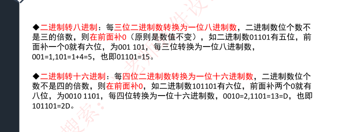
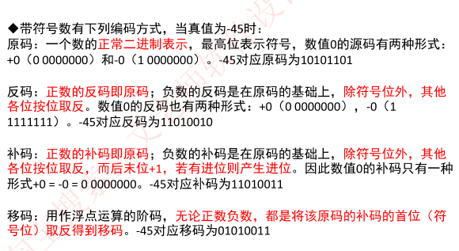
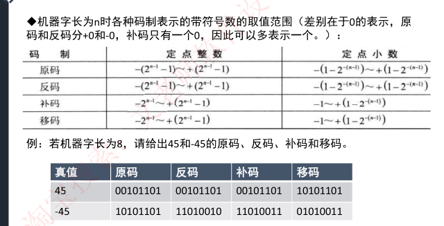
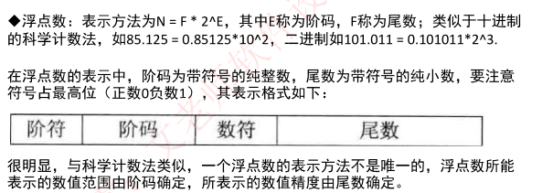
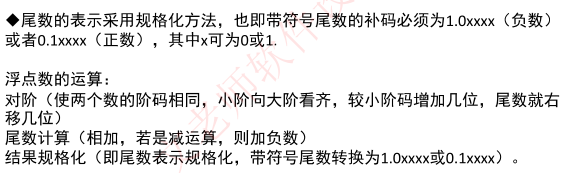
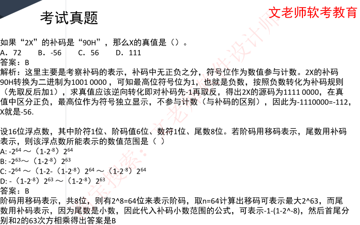
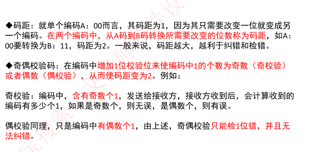
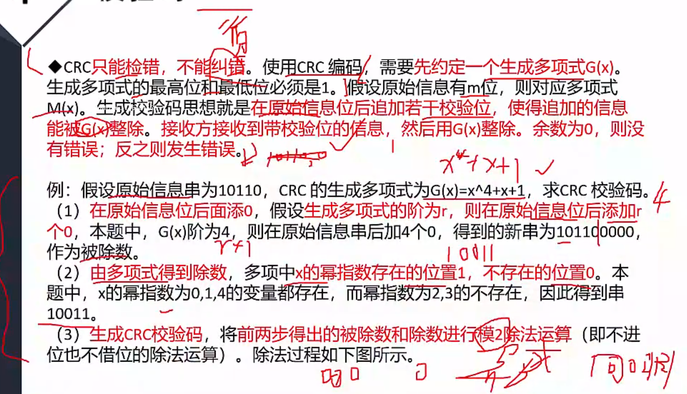
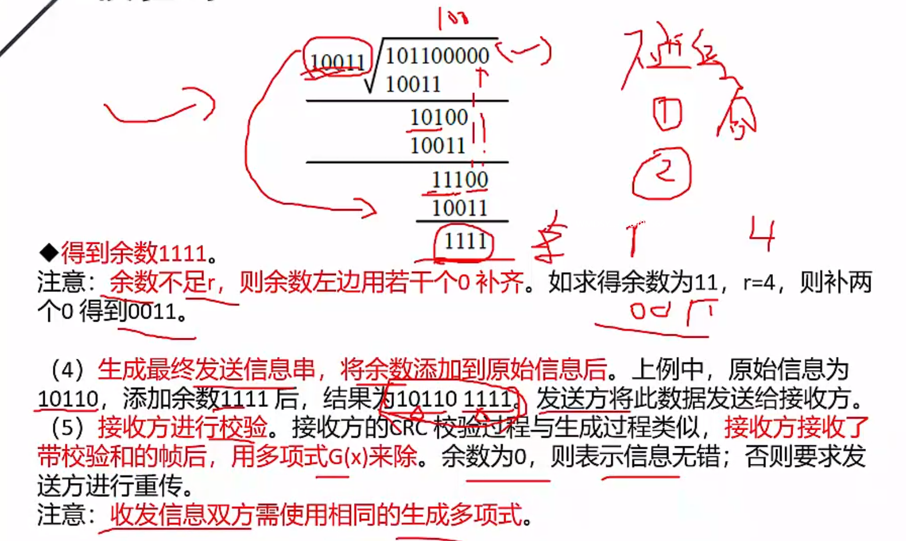
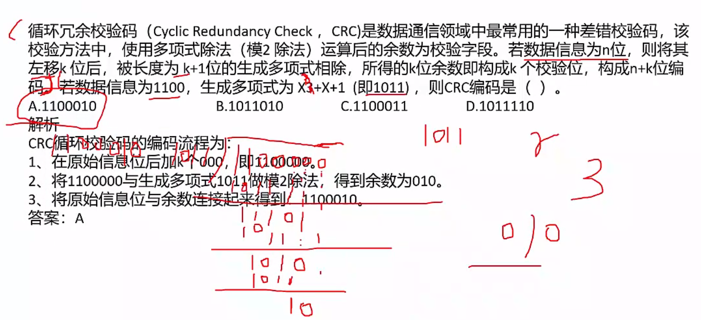

# 1 进制的表示

进制的表示：二进制、十六进制，一般在题目中会给出中文说明，如果没有给出，注意二进制符号为0b，一般表示为0b0011，十六进制符号为0x或H，可表示为0x18F或18FH。（十六进制可表示0-15，其中10-15用A-F表示）

R进制整数转十进制：位权展开法，用R进制数的每一位乘以R的n次方，n是变量，从R进制数的整数最低位开始，依次为0，1，2，3。。。累加。

例如有6进制数5043，此时R=6，用6进制数的每一位乘以6的男、次方，n是变量，从6进制数的整数最低位开始（5043从低位到高位排列：3，4，0，5），n依次为：0，1，2，3，那么最终5043=3* 6^0+4* 6^1+0* 6^2+5*6^3=1107

十进制转R进制：十进制整数（除以R倒取余数），用十进制整除以R，记录每次所得余数，若商不为0，则继续除以R，直至商为0，而后将所有余数从下至上记录，排列成从左至右顺序，即为转换后的R进制数。

例如：有十进制数200，转换为6进制，此时R=6，将200、6，得商为33，余数为2；因为商不等于0，因此再讲商33/6，得商为5，余数为3；再讲5/6，得商为0，余数为5；此时商为0，将所有余数从下到上记录，得532。

m进制转n进制：先将m进制转化为十进制数，再讲十进制数转化为n进制数，中间需要通过十进制中转，但是对于倍数是可以直接转，

# 校验码

